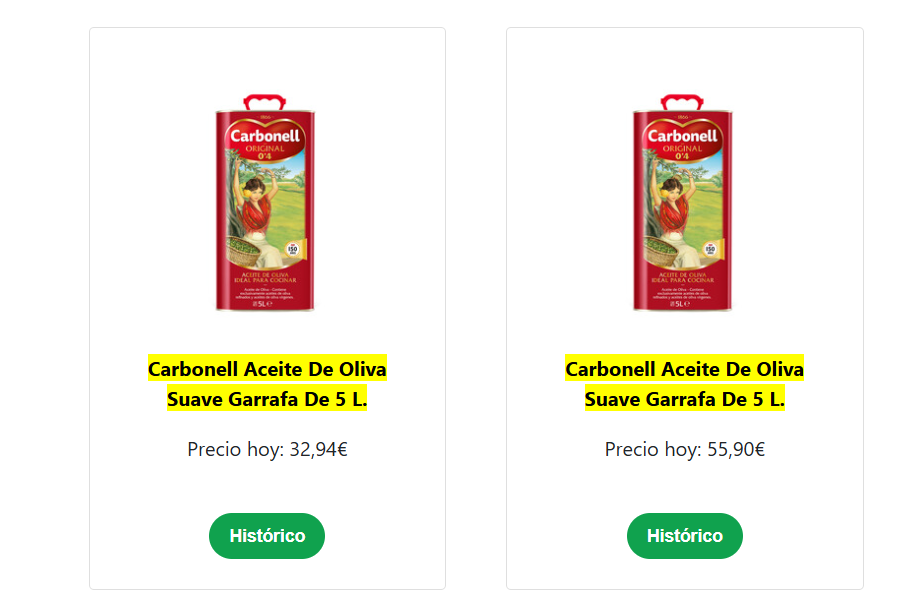
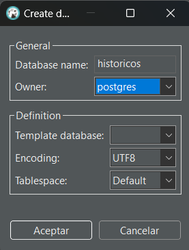

# 🛒 Análisis de Precios de Supermercados 📊

Este proyecto tiene como objetivo recopilar, procesar y analizar datos de precios de productos en distintos supermercados de España, con el fin de comparar precios, estudiar la evolución de precios a lo largo del tiempo y detectar posibles anomalías. La información recolectada permite visualizar la dispersión de precios entre supermercados y ofrece una base de datos sólida para futuras investigaciones de tendencias de precios.

# Descripción del Proyecto 💡

Este proyecto tiene como objetivo analizar los precios de productos en distintos supermercados en España, utilizando datos extraídos de la página [**FACUA: Precios Supermercados**](https://super.facua.org/) mediante técnicas de web scraping. Los datos recolectados se almacenan en una base de datos SQL y se analizan con Python y Pandas. 

## Principales Componentes del Proyecto 🔍

- **Comparación de precios**: Evaluamos las diferencias de precios entre supermercados para identificar las opciones más competitivas en el mercado.
- **Evolución de precios**: Analizamos las tendencias de los precios de distintos productos a lo largo del tiempo para entender su comportamiento y fluctuaciones.
- **Detección de anomalías**: Identificamos variaciones de precios inusuales para señalar anomalías o patrones inesperados en el mercado.
- **Visualización de datos**: Generamos gráficos interactivos con Plotly Express, facilitando la interpretación de los datos y permitiendo una exploración visual dinámica de los resultados.

Este análisis proporciona una visión detallada de cómo varían los precios en el mercado, ayudando a identificar patrones y realizar comparaciones útiles para el consumidor.

# Estructura del Proyecto 🗂️

```bash
Proyecto4-AnalisisFacua/
├── datos/                   # Tablas con la información de SQL.
│   ├── 01_backups/          # Backups de webscraping para no tener que rehacerlos.
│   ├── 02_consultas_sql/    # Tablas de las consultas realizadas en SQL.
│
├── notebooks/               # Notebooks de jupyter con el análisis y las visualizaciones.
├── src/                     # Archivos .py para las funciones utilizadas por el proyecto
│    ├── 01_png/             # Fotos de evidencias sobre hallazgos.
│    ├── 02_graficas/        
│    │    ├── html/          # Gráficas interactivas en HTML.  
│    │    ├── png/           # Fotos de las mismas gráficas.
│
└── README.md                # Descripción del proyecto, lo estás leyendo!
```


# Instalación y Requisitos 🛠️
## Requisitos

Para ejecutar este proyecto, asegúrate de tener instalado lo siguiente:

- **Python 3.x** 🐍
- **Jupyter Notebook** 📓 para ejecutar y visualizar los análisis de datos
- **Bibliotecas de Python**:
    - [pandas](https://pandas.pydata.org/docs/) para manipulación de datos 🧹
    - [numpy](https://numpy.org/doc/2.1/) para cálculos numéricos 🔢
    - [plotly.express](https://plotly.com/python/plotly-express/) para visualización de datos interactiva 📊
    - [requests](https://requests.readthedocs.io/en/latest/) para conectar con FACUA y realizar peticiones HTTP 🌐
    - [selenium](https://www.selenium.dev/documentation/) para interactuar con sitios web dinámicos 💻
    - [beautifulsoup4](https://beautiful-soup-4.readthedocs.io/en/latest/) para scraping de sitios web 🕸️
    - [dotenv](https://www.dotenv.org/docs/) para manejar variables de entorno de manera segura 🔐
    - [tqdm](https://tqdm.github.io/) para crear barras de progreso en los procesos largos ⏳
    - [psycopg2](https://www.psycopg.org/docs/) para conectarse y ejecutar consultas en PostgreSQL 🛢️
- **Para crear la Base de Datos**
    - [PostgreSQL](https://www.postgresql.org/) para la gestión y almacenamiento de datos relacionales 📂
    - [DBeaver](https://dbeaver.io/) para administración y consulta visual de bases de datos 🖥️

## Instalación 🛠️

1. Clona este repositorio para visualizarlo en vscode:
```bash
git clone https://github.com/apelsito/Proyecto4-AnalisisFacua.git
cd Proyecto4-AnalisisFacua
```
# Desarrollo del Proyecto 🚀

Este proyecto se ha desarrollado en varias fases para asegurar una recopilación y procesamiento de datos estructurados, seguido de su análisis. A continuación, se describen las fases clave:

## Fase 1: Scraping 🔍

La primera fase del proyecto consiste en recolectar datos de precios de productos mediante web scraping en la página de FACUA.

### Pasos:
1. **Obtener URLs de Supermercados**: Usando Selenium, recopilamos todas las URLs de los supermercados disponibles en la página.
2. **Extraer URLs de Productos**: A partir de las URLs de los supermercados, extraemos las URLs de las categorías clave:
    - **Aceite de girasol**
    - **Aceite de oliva**
    - **Leche**
3. **Obtener URLs de Subcategorías**: Nos adentramos en subcategorías específicas para mayor precisión en la extracción de datos:
    - **Aceite de oliva**: Suave e Intenso, Virgen, Virgen Extra.
    - **Leche**: Enriquecida, Entera/Semi/Desnatada, Sin Lactosa.

   Por cada supermercado, nos quedamos con las siguientes URLs específicas:
   - URL Aceite Girasol
   - URL Aceite de Oliva Suave e Intenso
   - URL Aceite de Oliva Virgen
   - URL Aceite de Oliva Virgen Extra
   - URL Leche Enriquecida
   - URL Leche Entera, Semi o Desnatada
   - URL Leche Sin Lactosa

4. **Extraer Historicos de Productos**: Con BeautifulSoup, extraemos las URLs del historial de cada producto para su análisis posterior.

### Observaciones del web-scraping 📌

Al revisar los datos en busca de duplicados, observamos que algunos productos aparecen listados dos veces en la web. Por ejemplo:



Al examinar los historiales de ambos productos duplicados, encontramos que la URL de cada uno es idéntica:


Esta duplicación en los listados ocurre de forma recurrente. Por ello, hemos decidido eliminar los duplicados sin riesgo de perder información, ya que los datos de cada producto duplicado se refieren al mismo ítem en la base de datos de Facua.

## Fase 2: Preparación Pre DB 🗄️

Antes de almacenar los datos en la base de datos, preparamos los DataFrames necesarios.

### Pasos:
1. **Separación de Tablas**: Organizamos los datos en cuatro tablas para la base de datos:
   - **Supermercado**
   - **Categoría**
   - **Producto**
   - **Histórico**
   
2. **Crear DataFrames**: Creamos DataFrames individuales para cada entidad con dos columnas:
   - Un índice único (iniciando en 1) para compatibilidad con SQL.
   - Una columna con los valores únicos de cada entidad.

3. **Generación de Claves Foráneas**: En el DataFrame de **Histórico**, generamos un diccionario de cada tabla, reemplazando los valores de Supermercado, Categoría y Producto por sus índices correspondientes. Esto permite establecer relaciones entre tablas en la base de datos mediante claves foráneas.

## Fase 3: Creación de la Base de Datos 🛢️

Con los DataFrames preparados, procedemos a crear la base de datos en PostgreSQL.

### Pasos:
1. **Configuración de la Base de Datos en DBeaver**:
   - Abrimos PostgreSQL en DBeaver y creamos una nueva base de datos llamada `historicos` con la siguiente configuración:

   
   

2. **Crear las Tablas**:
   - **Supermercados**:
     ```sql
     CREATE TABLE supermercados (
       id_supermercado SERIAL PRIMARY KEY,
       supermercado VARCHAR (100) NOT NULL
     );
     ```
   - **Categorías**:
     ```sql
     CREATE TABLE categorias (
       id_categoria SERIAL PRIMARY KEY,
       categoria VARCHAR (100) NOT NULL
     );
     ```
   - **Productos**:
     ```sql
     CREATE TABLE productos (
       id_producto SERIAL PRIMARY KEY,
       producto VARCHAR (1000) NOT NULL
     );
     ```
   - **Históricos**:
     ```sql
     CREATE TABLE historicos (
       id_supermercado INT NOT NULL,
       fecha DATE,
       id_producto INT NOT NULL,
       id_categoria INT NOT NULL,
       variacion_euros DECIMAL(5,2) NOT NULL,
       variacion_porcentaje DECIMAL(5,2) NOT NULL,
       FOREIGN KEY (id_producto) REFERENCES productos (id_producto) ON UPDATE CASCADE ON DELETE RESTRICT,
       FOREIGN KEY (id_categoria) REFERENCES categorias (id_categoria) ON UPDATE CASCADE ON DELETE RESTRICT,
       FOREIGN KEY (id_supermercado) REFERENCES supermercados (id_supermercado) ON UPDATE CASCADE ON DELETE RESTRICT
     );
     ```

Estas tablas estructuran los datos de manera que se puedan realizar consultas eficientes y mantener la integridad de las relaciones entre los datos.

# Visualización y Análisis de Gráficas 📊

Para profundizar en los datos recolectados, hemos realizado diversas consultas SQL que nos permiten extraer información clave sobre precios, variaciones y patrones de los productos en los supermercados. Estas consultas nos facilitan analizar la dispersión de precios, identificar tendencias y detectar anomalías. A continuación, presentaremos una serie de gráficas interactivas basadas en estos datos, que ofrecen una visión clara y detallada del comportamiento de los precios en el mercado.


## Conclusiones ✈️


# Contribuciones 🤝

Las contribuciones a este proyecto son muy bienvenidas. Si tienes alguna sugerencia, mejora o corrección, no dudes en ponerte en contacto o enviar tus ideas.

Cualquier tipo de contribución, ya sea en código, documentación o feedback, será valorada. ¡Gracias por tu ayuda y colaboración!

# Autores y Agradecimientos ✍️

## Autor ✒️
**Gonzalo Ruipérez Ojea** - [@apelsito](https://github.com/apelsito) en github

## Agradecimientos
Quiero expresar mi agradecimiento a **Hackio** y su equipo por brindarme la capacidad y las herramientas necesarias para realizar este proyecto con solo una semana de formación. Su apoyo ha sido clave para lograr este trabajo.

