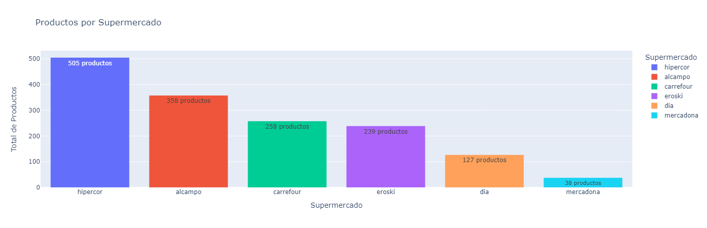
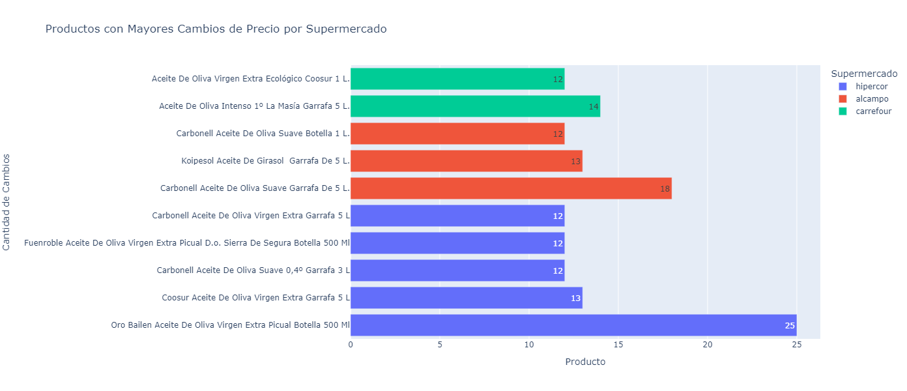
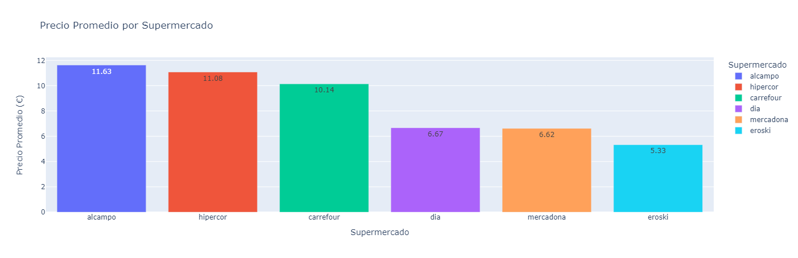
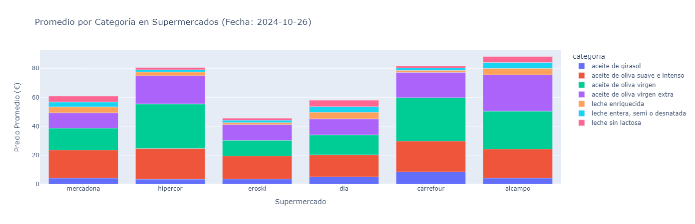
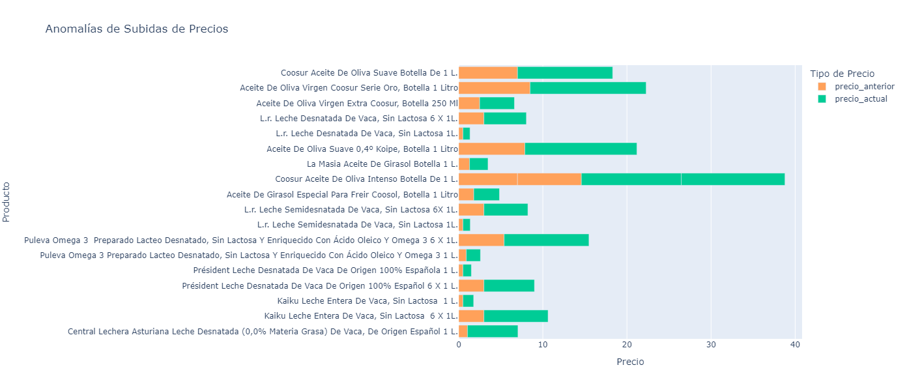
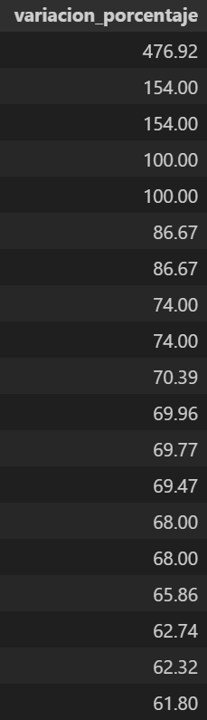
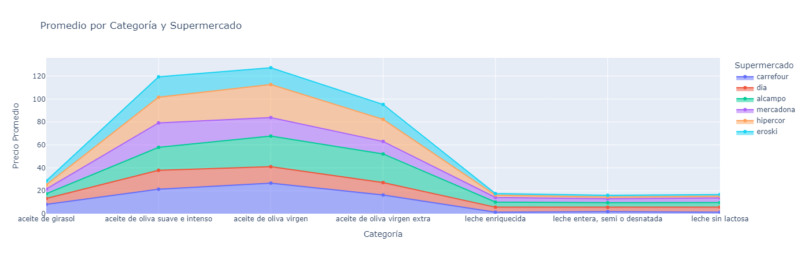

# 🛒 Análisis de Precios de Supermercados 📊

Este proyecto tiene como objetivo recopilar, procesar y analizar datos de precios de productos en distintos supermercados de España, con el fin de comparar precios, estudiar la evolución de precios a lo largo del tiempo y detectar posibles anomalías. La información recolectada permite visualizar la dispersión de precios entre supermercados y ofrece una base de datos sólida para futuras investigaciones de tendencias de precios.

# Descripción del Proyecto 💡

Este proyecto tiene como objetivo analizar los precios de productos en distintos supermercados en España, utilizando datos extraídos de la página [**FACUA: Precios Supermercados**](https://super.facua.org/) mediante técnicas de web scraping. Los datos recolectados se almacenan en una base de datos SQL y se analizan con Python y Pandas. 

## Principales Componentes del Proyecto 🔍

- **Comparación de precios**: Evaluamos las diferencias de precios entre supermercados para identificar las opciones más competitivas en el mercado.
- **Evolución de precios**: Analizamos las tendencias de los precios de distintos productos a lo largo del tiempo para entender su comportamiento y fluctuaciones.
- **Detección de anomalías**: Identificamos variaciones de precios inusuales para señalar anomalías o patrones inesperados en el mercado.
- **Visualización de datos**: Generamos gráficos interactivos con Plotly Express, facilitando la interpretación de los datos y permitiendo una exploración visual dinámica de los resultados.

Este análisis proporciona una visión detallada de cómo varían los precios en el mercado, ayudando a identificar patrones y realizar comparaciones útiles para el consumidor.

# Estructura del Proyecto 🗂️

```bash
Proyecto4-AnalisisFacua/
├── datos/                   # Tablas con la información de SQL.
│   ├── 01_backups/          # Backups de webscraping para no tener que rehacerlos.
│   ├── 02_consultas_sql/    # Tablas de las consultas realizadas en SQL.
│
├── notebooks/               # Notebooks de jupyter con el análisis y las visualizaciones.
├── src/                     # Archivos .py para las funciones utilizadas por el proyecto
│    ├── 01_png/             # Fotos de evidencias sobre hallazgos.
│    ├── 02_graficas/        
│    │    ├── html/          # Gráficas interactivas en HTML.  
│    │    ├── png/           # Fotos de las mismas gráficas.
│
└── README.md                # Descripción del proyecto, lo estás leyendo!
```


# Instalación y Requisitos 🛠️
## Requisitos

Para ejecutar este proyecto, asegúrate de tener instalado lo siguiente:

- **Python 3.x** 🐍
- **Jupyter Notebook** 📓 para ejecutar y visualizar los análisis de datos
- **Bibliotecas de Python**:
    - [pandas](https://pandas.pydata.org/docs/) para manipulación de datos 🧹
    - [numpy](https://numpy.org/doc/2.1/) para cálculos numéricos 🔢
    - [plotly.express](https://plotly.com/python/plotly-express/) para visualización de datos interactiva 📊
    - [requests](https://requests.readthedocs.io/en/latest/) para conectar con FACUA y realizar peticiones HTTP 🌐
    - [selenium](https://www.selenium.dev/documentation/) para interactuar con sitios web dinámicos 💻
    - [beautifulsoup4](https://beautiful-soup-4.readthedocs.io/en/latest/) para scraping de sitios web 🕸️
    - [dotenv](https://www.dotenv.org/docs/) para manejar variables de entorno de manera segura 🔐
    - [tqdm](https://tqdm.github.io/) para crear barras de progreso en los procesos largos ⏳
    - [psycopg2](https://www.psycopg.org/docs/) para conectarse y ejecutar consultas en PostgreSQL 🛢️
- **Para crear la Base de Datos**
    - [PostgreSQL](https://www.postgresql.org/) para la gestión y almacenamiento de datos relacionales 📂
    - [DBeaver](https://dbeaver.io/) para administración y consulta visual de bases de datos 🖥️

## Instalación 🛠️

1. Clona este repositorio para visualizarlo en vscode:
```bash
git clone https://github.com/apelsito/Proyecto4-AnalisisFacua.git
cd Proyecto4-AnalisisFacua
```
# Desarrollo del Proyecto 🚀

Este proyecto se ha desarrollado en varias fases para asegurar una recopilación y procesamiento de datos estructurados, seguido de su análisis. A continuación, se describen las fases clave:

## Fase 1: Scraping 🔍

La primera fase del proyecto consiste en recolectar datos de precios de productos mediante web scraping en la página de FACUA.

### Pasos:
1. **Obtener URLs de Supermercados**: Usando Selenium, recopilamos todas las URLs de los supermercados disponibles en la página.
2. **Extraer URLs de Productos**: A partir de las URLs de los supermercados, extraemos las URLs de las categorías clave:
    - **Aceite de girasol**
    - **Aceite de oliva**
    - **Leche**
3. **Obtener URLs de Subcategorías**: Nos adentramos en subcategorías específicas para mayor precisión en la extracción de datos:
    - **Aceite de oliva**: Suave e Intenso, Virgen, Virgen Extra.
    - **Leche**: Enriquecida, Entera/Semi/Desnatada, Sin Lactosa.

   Por cada supermercado, nos quedamos con las siguientes URLs específicas:
   - URL Aceite Girasol
   - URL Aceite de Oliva Suave e Intenso
   - URL Aceite de Oliva Virgen
   - URL Aceite de Oliva Virgen Extra
   - URL Leche Enriquecida
   - URL Leche Entera, Semi o Desnatada
   - URL Leche Sin Lactosa

4. **Extraer Historicos de Productos**: Con BeautifulSoup, extraemos las URLs del historial de cada producto para su análisis posterior.

### Observaciones del web-scraping 📌

Al revisar los datos en busca de duplicados, observamos que algunos productos aparecen listados dos veces en la web. Por ejemplo:


Al examinar los historiales de ambos productos duplicados, encontramos que la URL de cada uno es idéntica:


Esta duplicación en los listados ocurre de forma recurrente. Por ello, hemos decidido eliminar los duplicados sin riesgo de perder información, ya que los datos de cada producto duplicado se refieren al mismo ítem en la base de datos de Facua.

## Fase 2: Preparación Pre DB 🗄️

Antes de almacenar los datos en la base de datos, preparamos los DataFrames necesarios.

### Pasos:
1. **Separación de Tablas**: Organizamos los datos en cuatro tablas para la base de datos:
   - **Supermercado**
   - **Categoría**
   - **Producto**
   - **Histórico**
   
2. **Crear DataFrames**: Creamos DataFrames individuales para cada entidad con dos columnas:
   - Un índice único (iniciando en 1) para compatibilidad con SQL.
   - Una columna con los valores únicos de cada entidad.

3. **Generación de Claves Foráneas**: En el DataFrame de **Histórico**:
 - Generamos un diccionario de cada tabla, reemplazando los valores de Supermercado, Categoría y Producto por sus índices correspondientes. Esto permite establecer relaciones entre tablas en la base de datos mediante claves foráneas.

## Fase 3: Creación de la Base de Datos 🛢️

Con los DataFrames preparados, procedemos a crear la base de datos en PostgreSQL.

### Pasos:
1. **Configuración de la Base de Datos en DBeaver**:
   - Abrimos PostgreSQL en DBeaver y creamos una nueva base de datos llamada `historicos` con la siguiente configuración:

   

   

2. **Crear las Tablas**:
   - **Supermercados**:
     ```sql
     CREATE TABLE supermercados (
       id_supermercado SERIAL PRIMARY KEY,
       supermercado VARCHAR (100) NOT NULL
     );
     ```
   - **Categorías**:
     ```sql
     CREATE TABLE categorias (
       id_categoria SERIAL PRIMARY KEY,
       categoria VARCHAR (100) NOT NULL
     );
     ```
   - **Productos**:
     ```sql
     CREATE TABLE productos (
       id_producto SERIAL PRIMARY KEY,
       producto VARCHAR (1000) NOT NULL
     );
     ```
   - **Históricos**:
     ```sql
     CREATE TABLE historicos (
       id_supermercado INT NOT NULL,
       fecha DATE,
       id_producto INT NOT NULL,
       id_categoria INT NOT NULL,
       variacion_euros DECIMAL(5,2) NOT NULL,
       variacion_porcentaje DECIMAL(5,2) NOT NULL,
       FOREIGN KEY (id_producto) REFERENCES productos (id_producto) ON UPDATE CASCADE ON DELETE RESTRICT,
       FOREIGN KEY (id_categoria) REFERENCES categorias (id_categoria) ON UPDATE CASCADE ON DELETE RESTRICT,
       FOREIGN KEY (id_supermercado) REFERENCES supermercados (id_supermercado) ON UPDATE CASCADE ON DELETE RESTRICT
     );
     ```

Estas tablas estructuran los datos de manera que se puedan realizar consultas eficientes y mantener la integridad de las relaciones entre los datos.

## Fase 4: Consultas SQL y Análisis de Datos 📊

En esta fase, realizamos diversas consultas SQL para analizar los datos recopilados, enfocándonos en obtener información útil y patrones significativos. Este análisis nos permite comparar precios, identificar tendencias y detectar posibles anomalías en los datos de precios de los productos en distintos supermercados.

## Fase 5: Visualización de Datos en Gráficas 📈

En esta fase final, verificamos que los datos puedan visualizarse en gráficos de manera significativa. Para ello, nos aseguramos de que las tablas y los resultados de las consultas estén estructurados adecuadamente, permitiendo generar visualizaciones que reflejen de forma clara y coherente los patrones y comparaciones analizados previamente.

# Análisis de las Gráficas obtenidas 📊

Para profundizar en los datos recolectados, hemos realizado diversas consultas SQL que nos permiten extraer información clave sobre precios, variaciones y patrones de los productos en los supermercados. Estas consultas nos facilitan analizar la dispersión de precios, identificar tendencias y detectar anomalías.

A continuación, presentaremos una serie de gráficas interactivas basadas en estos datos, que ofrecen una visión clara y detallada del comportamiento de los precios en el mercado.

Podrás encontrar todas las gráficas interactivas en  o si prefieres verlas desde su HTML podrás acceder desde 

## Productos por Supermercado



- La gráfica indica el número total de productos disponibles en la web de Facua.
- Hipercor lidera en número de productos, seguido de Alcampo y Carrefour. Mercadona tiene el menor número de productos listados.
- **Limitaciones de la Muestra**: Dado que los datos de precios provienen únicamente de los productos que FACUA ha listado, la cantidad de productos en cada supermercado no refleja la totalidad de su inventario. Esto significa que los supermercados con menos productos en la lista pueden tener menos representatividad en el análisis.
- **Implicaciones para el Análisis de Precios**: Supermercados como Mercadona, con menos productos listados, podrían tener una cobertura de precios limitada. Esto podría hacer que el precio promedio calculado para este supermercado sea menos robusto o representativo del total de productos que realmente ofrece.

- **En contraste**, Hipercor y Alcampo, que tienen más productos listados, permiten un análisis más robusto y probablemente representativo de sus estrategias de precios y variedad de productos.

- **Precauciones en las Conclusiones**: Al interpretar los precios promedio, es importante recordar que un menor número de productos listados (como en el caso de Mercadona) puede sesgar la media hacia los productos específicos que FACUA decidió incluir.

Por lo tanto, las conclusiones sobre estrategias de precios deben tomarse con precaución, especialmente para supermercados con menor representación en los datos.

## Productos con más cambios de precio



- Se muestra la cantidad de veces que el precio de un producto ha cambiado y de que supermercado procede.
- Se observa que todos los productos son algún tipo de aceite, esto es muy probable que se deba a la alta volatilidad que tiene este producto, asociado con la inflación, demanda o costes de producción

## Precio Promedio por Supermercado



- La gráfica de barras muestra el precio promedio de los productos en cada supermercado.
- Alcampo tiene el precio promedio más alto, seguido de Hipercor y Carrefour, mientras que Eroski tiene el precio promedio más bajo.
- Esta diferencia en precios podría reflejar las estrategias de mercado de cada supermercado. Por ejemplo, Alcampo e Hipercor podrían estar ofreciendo productos de mayor calidad o marcas más costosas, mientras que Eroski y Mercadona parecen centrarse en opciones más asequibles.

## Precio Promedio por Categoría (Fecha específica)
Esta gráfica se ha creado con el objetivo de poder analizar el precio promedio en un día específico, separado por categoría y supermercado, puedes modificar esta gráfica para analizar la fecha que tu quieras



- Esta gráfica apilada muestra el precio promedio de diferentes categorías de productos en cada supermercado en una fecha específica (2024-10-26).
- Se observan variaciones importantes en las categorías de aceites de oliva y girasol, que tienden a tener precios más altos que otros productos como leche.
- Esto podría estar indicando un patrón de precios en el mercado de aceites, con categorías específicas (como "aceite de oliva virgen" y "aceite de oliva suave e intenso") que representan una mayor proporción del precio en varios supermercados.

## Anomalías en los Precios

 

- La gráfica muestra productos con subidas notables en sus precios, con precio_anterior (en naranja) y precio_actual (en verde). La diferencia entre ambos refleja las variaciones de precio para cada producto.
- El producto con el mayor aumento es **Central Lechera Asturiana Leche Desnatada (0,0% Materia Grasa)**, con un incremento del **476.92%** respecto al precio anterior. Esta alteración podría ser bien un error o bien una práctica abusiva de un producto que promete engordar menos, habría que analizarlo con más detalle
- Los **aceites (tanto de oliva como de girasol)** dominan esta lista de anomalías de precios. Esto podría estar reflejando una tendencia en el mercado en la cual los aceites, posiblemente por factores como la inflación o la escasez de insumos, han experimentado fuertes aumentos de precio.
- La **leche desnatada y productos lácteos** también muestran aumentos significativos, lo cual podría estar relacionado con cambios en los costos de producción, transporte o demanda en productos lácteos.

## Promedio por Categoría y Supermercado



- La gráfica muestra el precio promedio de cada categoría de producto en varios supermercados.
- Se observa que el precio del "aceite de oliva virgen extra" y "aceite de oliva suave e intenso" es el más alto en todas las tiendas, lo cual es consistente con la tendencia general en el mercado de aceites.
- Los precios de las categorías de leche son relativamente uniformes y bajos en comparación con los aceites (aún teniendo en cuenta que la leche ha subido también), lo que podría ser una indicación de que los supermercados intentan mantener precios competitivos en productos básicos.

# Conclusiones del Proyecto 📊
Este proyecto ha permitido analizar las variaciones de precios en productos de supermercados listados en FACUA, con un enfoque en productos esenciales y su volatilidad en el mercado.

## Cobertura de Productos y Limitaciones
- **Representatividad de Datos**: Los precios promedio en algunos supermercados (como Mercadona) pueden no ser representativos debido a la limitada cantidad de productos listados, lo cual podría sesgar los resultados.
## Volatilidad en Productos Esenciales
- **Aceites y Lácteos**: Los aceites (oliva y girasol) y ciertos productos lácteos muestran las mayores fluctuaciones de precio. Esto refleja su sensibilidad a factores como inflación y costos de producción.
## Estrategias de Precios por Supermercado
- **Segmentación de Mercado**: Supermercados como Alcampo y Hipercor tienden a tener precios promedio más altos, posiblemente enfocados en productos de mayor calidad. En cambio, Eroski y Mercadona presentan opciones más asequibles, sugiriendo una estrategia orientada a precios bajos.

## Recomendaciones
- **Monitoreo Continuo**: Dado el impacto en productos de primera necesidad, se recomienda monitorear continuamente estos precios.
- **Estrategia de Compra**: Los consumidores pueden beneficiarse comparando precios entre supermercados y aprovechando alternativas en productos con menor volatilidad.

Este análisis ayuda a los consumidores a tomar decisiones informadas en un contexto de precios volátiles, especialmente en productos de uso cotidiano.

# Próximos Pasos 🚀
Para continuar mejorando este análisis de precios y profundizar en los patrones observados, se plantean los siguientes pasos:

1. **Separación y Normalización de Productos**
- **Extracción de Marcas**: Implementar un proceso de limpieza de datos para separar el nombre de la marca de cada producto. Esto permitirá analizar tendencias de precios a nivel de marca y corregir productos duplicados o catalogados de distinta forma por FACUA.
- **Unificación de Productos Similares**: Identificar y agrupar productos que son esencialmente iguales pero están listados con variaciones menores en el nombre, para obtener un análisis más preciso de cada ítem.
2. **Comparación de Precios por Supermercado**
- **Análisis Comparativo entre Supermercados**: Realizar un análisis cruzado de precios para el mismo producto en diferentes supermercados. Esto permitirá identificar variaciones de precios para un mismo producto, detectando posibles estrategias de precios y destacando dónde pueden encontrarse las mejores ofertas.
- **Seguimiento de Cambios a Largo Plazo**: Monitorear la evolución de los precios de productos específicos a lo largo del tiempo en los distintos supermercados para detectar tendencias o patrones estacionales.
3. Extensión del Análisis a Nuevas Categorías
- **Ampliación a Otros Productos**: Incorporar más categorías de productos, más allá de aceites y lácteos, para obtener un panorama más completo del comportamiento de precios en productos de consumo masivo.
- **Análisis de Productos Estacionales**: Incluir productos que suelen tener variación de precio en ciertas épocas del año, como frutas y verduras, para observar patrones estacionales y ayudar a los consumidores a planificar sus compras.
4. Mejora de Visualizaciones y Reportes
- **Visualizaciones Interactivas**: Implementar visualizaciones adicionales para que los usuarios puedan explorar los datos por sí mismos y seleccionar categorías, marcas y fechas de interés.
- **Reportes Automatizados**: Crear un sistema de reportes automatizados que genere análisis periódicos sobre la evolución de precios y detecte automáticamente anomalías o cambios bruscos en productos clave.

# Contribuciones 🤝

Las contribuciones a este proyecto son muy bienvenidas. Si tienes alguna sugerencia, mejora o corrección, no dudes en ponerte en contacto o enviar tus ideas.

Cualquier tipo de contribución, ya sea en código, documentación o feedback, será valorada. ¡Gracias por tu ayuda y colaboración!

# Autores y Agradecimientos ✍️

## Autor ✒️
**Gonzalo Ruipérez Ojea** - [@apelsito](https://github.com/apelsito) en github

## Agradecimientos ❤️
Quiero expresar mi agradecimiento a **Hackio** y su equipo por brindarme la capacidad y las herramientas necesarias para realizar este proyecto con solo una semana de formación. Su apoyo ha sido clave para lograr este trabajo.

